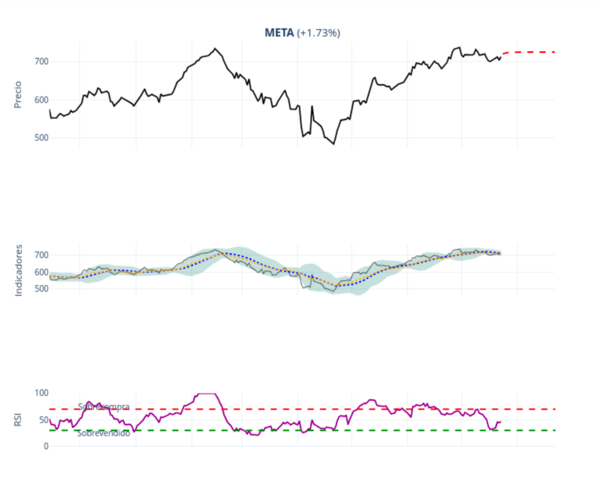
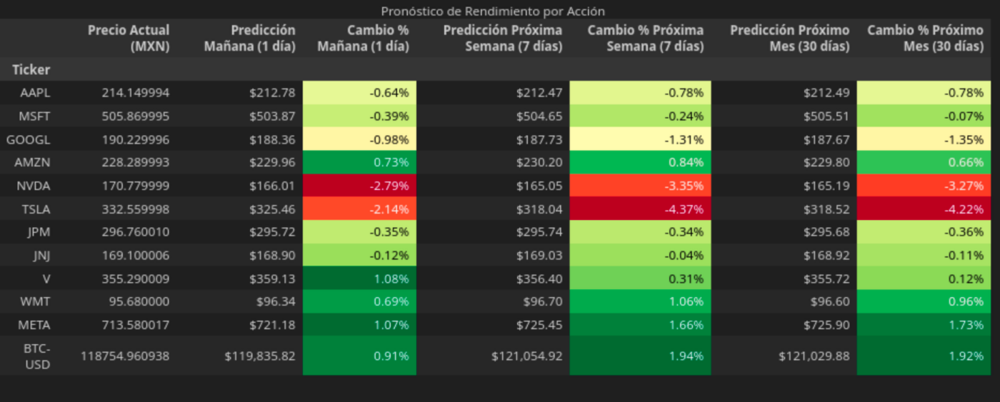
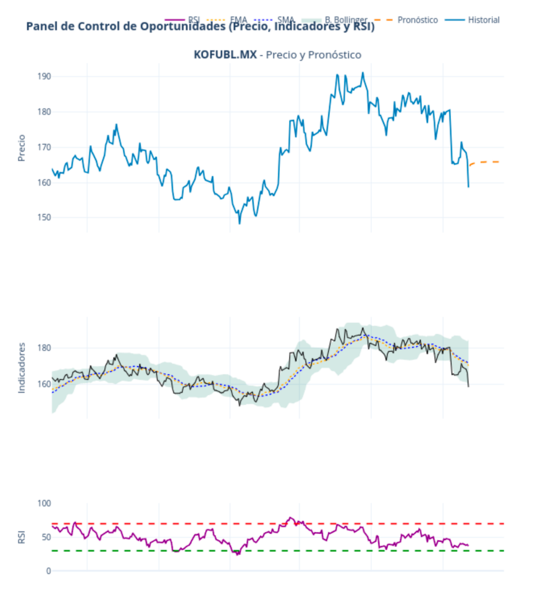
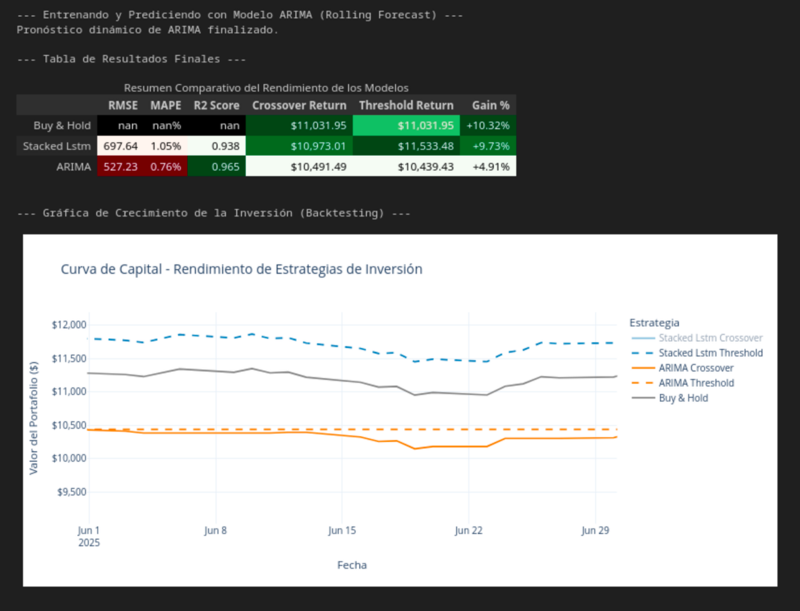

# Análisis y Pronóstico de Acciones con LSTMs y MLOps

Este repositorio contiene un pipeline avanzado de Machine Learning para el análisis y pronóstico de precios de acciones, utilizando Redes Neuronales Recurrentes (LSTM) multivariadas. El proyecto demuestra un flujo de trabajo de extremo a extremo, desde la ingesta de datos y la ingeniería de características hasta la optimización de hiperparámetros y la preparación de artefactos para un entorno de producción.

El pipeline ha sido implementado y probado en dos mercados distintos para demostrar su flexibilidad:
1.  **Mercado Mexicano (BMV)**: Enfocado en acciones del S&P/BMV IPC y variables macroeconómicas relevantes para México.
2.  **Mercado Estadounidense (NYSE/NASDAQ)**: Enfocado en acciones de alta capitalización y el S&P 500 como benchmark.

## 🚀 Características Principales

-   **Modelado Avanzado con LSTMs**: Utiliza redes LSTM multivariadas en PyTorch, capaces de capturar complejas dependencias temporales entre el precio de una acción y múltiples variables exógenas.
-   **Ingeniería de Características Robusta**: Incorpora una amplia gama de datos para enriquecer el modelo:
    -   **Datos de Mercado**: Precios de cierre de un portafolio diversificado para capturar la correlación del mercado.
    -   **Indicadores Macroeconómicos**: Tipos de cambio (USD/MXN), tasas de interés (^TNX) e índices de mercado (^MXX, ^GSPC) como features.
    -   **Indicadores Técnicos**: Cálculo automatizado de SMA, EMA, Bandas de Bollinger, RSI, MACD, Oscilador Estocástico y ATR.
    -   **Datos Fundamentales**: Ratios P/E (Precio/Ganancias) y P/B (Precio/Valor en Libros) para cada acción.
-   **Optimización Automática de Hiperparámetros**: Integra **Optuna** para realizar una búsqueda sistemática de la mejor arquitectura de modelo (Simple vs. Stacked LSTM) y sus hiperparámetros (`learning rate`, `hidden_size`, `num_layers`, `dropout`), minimizando el error en una validación cruzada de series temporales (`TimeSeriesSplit`).
-   **Enfoque Orientado a Producción (MLOps)**: Para la acción con el mejor pronóstico, el pipeline guarda automáticamente los artefactos necesarios para su despliegue:
    -   El estado del modelo entrenado (`.pth`).
    -   El objeto escalador de datos (`.joblib`).
    -   Los metadatos del modelo (columnas, parámetros) en formato `.json`.
-   **Análisis Comparativo y Visualización**:
    -   Genera tablas de resultados estilizadas que resumen el rendimiento esperado en diferentes horizontes de tiempo (1, 7 y 30 días).
    -   Crea un panel de control interactivo con **Plotly** para visualizar el historial de precios, los indicadores técnicos, el RSI y los pronósticos de las mejores oportunidades.
    -   Incluye una comparación de rendimiento entre la estrategia LSTM, un modelo ARIMA de benchmark y el índice de mercado (S&P 500 / IPC).

## 📂 Estructura del Repositorio

-   `multi-var-lstm-hyperpipe.ipynb`: Notebook principal aplicado al mercado estadounidense.
-   `mx_rnn_stocks.ipynb`: Notebook adaptado para el mercado mexicano (BMV).
-   `rnn_multi_lstm.ipynb`: Notebook con el pipeline base de LSTM multivariado.
-   `production_artifacts/` y `production_artifacts_mx/`: Directorios donde se guardan los artefactos de los mejores modelos.

## 🛠️ Stack Tecnológico

-   **Análisis y Modelado**: `Python`, `PyTorch`, `Optuna`, `Scikit-learn`, `Statsmodels`
-   **Manipulación de Datos**: `Pandas`, `NumPy`
-   **Adquisición de Datos**: `yfinance`
-   **Visualización**: `Plotly`, `Matplotlib`
-   **Serialización de Artefactos**: `Joblib`, `JSON`

## 🚀 Notebooks y Dashboards Interactivos

Puedes ejecutar el código directamente en la nube usando Google Colab o ver los resultados interactivos a través de los enlaces de GitHub Pages.

---

### 1. Pipeline Avanzado (Mercado de EE.UU. y BTC)
Análisis principal para acciones de alta capitalización. Incluye optimización con Optuna y comparación con ARIMA.

- **Notebook**: 

- **Resultado Interactivo**:
  - [**Ver el Panel de Control Interactivo 1**](https://nachovazquez98.github.io/Portafolio-Acciones-LSTMs/multi-var-lstm-hyperpipe.html)

### 2. Pipeline Adaptado para el Mercado Mexicano (BMV)
Análisis enfocado en las principales acciones del S&P/BMV IPC.

- **Notebook**: 

- **Resultado Interactivo**:
  - [**Ver el Panel de Control Interactivo 2**](https://nachovazquez98.github.io/Portafolio-Acciones-LSTMs/mx_rnn_stocks.html)

### 3. Pipeline Base de LSTM Multivariado
Versión fundamental del pipeline que sienta las bases para los análisis más avanzados.

- **Notebook**: 

- **Resultado Interactivo**:
  - [**Ver el Panel de Control Interactivo 3**](https://nachovazquez98.github.io/Portafolio-Acciones-LSTMs/rnn_multi_lstm.html)

---

## 📊 Visualizaciones y Resultados Destacados

A continuación se muestran los resultados visuales clave generados por los pipelines. Las imágenes son una vista previa estática. **Haz clic en cualquier imagen para ver la versión HTML interactiva completa alojada en GitHub Pages.**

### 📈 Mercado Estadounidense

**Tabla de Rendimiento y Comparativa de Estrategias**

**Panel de Control de Oportunidades (Top 5)**

---

### 🇲🇽 Mercado Mexicano (BMV)

**Tabla de Pronósticos de Rendimiento para la BMV**

**Panel de Control de Oportunidades (Top 3)**

---

## 💡 Próximos Pasos

-   **Crear un Script de Inferencia**: Desarrollar un script `predict.py` que cargue los artefactos guardados para realizar predicciones sobre nuevos datos sin reentrenar.
-   **Backtesting Riguroso**: Implementar una estrategia de backtesting para simular operaciones de compra/venta y evaluar el rendimiento financiero histórico del modelo.
-   **Incorporar Análisis de Sentimiento**: Añadir sentimiento de noticias financieras como una nueva característica para capturar el "mood" del mercado.
-   **Orquestación y Automatización**: Utilizar herramientas como Airflow o Prefect para programar la ejecución periódica del pipeline.
